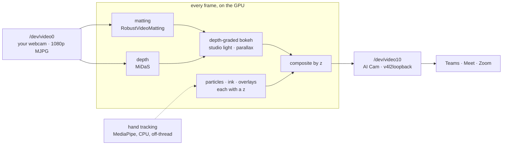
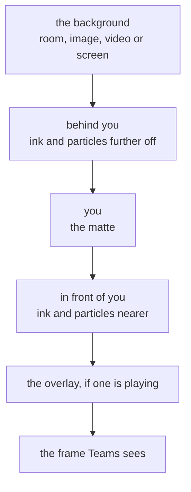
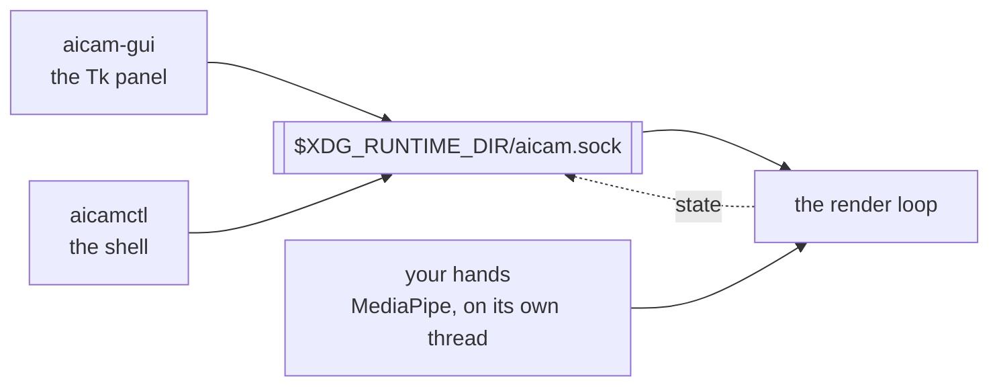

# aicam

A virtual webcam for Linux with depth-aware background effects and reactions,
running on your GPU. Teams, Meet, Zoom and anything else that speaks V4L2 sees
it as an ordinary camera.

macOS and Windows composite their reactions as a flat layer over the video.
aicam estimates a depth map, so **fireworks go off behind you and are occluded
by your shoulder** while confetti falls in front. Same reason a book you hold up
stays sharp when the background is blurred: it is nearer than the focus plane,
and the pipeline knows that.

Your webcam goes in, a second camera device comes out, and everything in
between is a depth map:



What it does, in one list:

- **Reactions that respect depth** - confetti in front of you, fireworks behind
  your shoulder
- **Cinematic mode** - depth-graded bokeh and studio lighting, not a flat blur
- **Background replacement** that still lets through whatever you hold up
- **Your screen, a window, a video or a YouTube link** as the background
- **Draw in the air** with your finger, and the ink keeps the depth you drew it at
- **Hand gestures** to fire any of it, plus a Tk panel and a CLI for when they misfire
- **Auto-framing** and a virtual camera move, from one still camera

## Requirements

- Linux with `v4l2loopback` (ships with `linux-modules-$(uname -r)` on Ubuntu 24.04)
- An NVIDIA GPU with CUDA. Measured on an RTX 4070 SUPER; anything from a 2060 up
  should hold 30 fps.
- `ffmpeg` (also provides `ffplay`, used for the preview)
- Python 3.10+

## Install

```sh
git clone <your fork> aicam && cd aicam
python3 -m venv --system-site-packages .venv
.venv/bin/pip install torch opencv-python-headless numpy timm

# Gestures. --no-deps keeps mediapipe from replacing opencv-python-headless
# with opencv-contrib-python, which would shadow the build everything else uses.
.venv/bin/pip install --no-deps mediapipe
.venv/bin/pip install absl-py flatbuffers protobuf attrs sounddevice matplotlib

./setup-models.sh          # hand landmarker; the other models self-download
```

Then the loopback device, once (survives reboot):

```sh
sudo tee /etc/modprobe.d/v4l2loopback.conf >/dev/null <<'CONF'
options v4l2loopback devices=1 video_nr=10 card_label="AI Cam" exclusive_caps=1
CONF
echo v4l2loopback | sudo tee /etc/modules-load.d/v4l2loopback.conf >/dev/null
sudo modprobe v4l2loopback
```

`exclusive_caps=1` is required. Without it the device advertises itself as both
input and output at once, and Chrome refuses to list it.

### Desktop entry

```sh
./install.sh               # menu entry + icon, launchers in ~/.local/bin
./install.sh --service     # ...and a systemd --user unit, off by default
./install.sh --uninstall
```

**aicam** then shows up in the application menu and opens the control panel,
with a Start button for the pipeline itself. Nothing is copied: the venv, the
weights and the backgrounds stay in the checkout and everything installed points
back at it, so `git pull` is the whole upgrade. `aicam`, `aicam-gui` and
`aicamctl` become symlinks in `~/.local/bin`, which is why the scripts resolve
their own path with `readlink` before looking for their siblings.

The panel sets its Tk `className`, so the window reports `WM_CLASS = "aicam"`
and the shell can pair it with the desktop entry; without that Tk calls itself
`Tk` and the window gets a generic icon.

## Use

```sh
./aicam                                   # uniform background blur
./aicam --mode cinematic                  # depth-graded bokeh + studio light
./aicam --mode cinematic --preview        # with an ffplay window
./aicam --background backgrounds/studio.jpg
```

Then pick **AI Cam** as your camera. The real camera must be free when aicam
starts; Chrome does not release `/dev/video0` until every tab that used it is
closed.

The panel opens as tall as it needs, or as tall as the monitor it lands on,
whichever is less - and scrolls when it is the latter. On a multi-head X11
session that means the monitor it is actually on, not the two of them added
together, which is what Tk will tell you if you ask it. The wheel scrolls from
anywhere on the panel, dropdowns included: ttk would otherwise let a scroll past
the Tool list quietly change your tool.

### Cinematic mode

Defocus increases gradually with distance instead of switching at the silhouette,
and a virtual key and rim light are applied to the subject.

| flag | |
|---|---|
| `--aperture 45` | how shallow the focus is. 30 is discreet, 60 is obvious. |
| `--light 0.25` | key light. Shapes the subject rather than just brightening it. |
| `--rim 0.4` | rim light on the silhouette; what separates you from the background. |
| `--highlights 0` | bloom point lights into bokeh discs. See below. |
| `--keep-near 0.35` | with `--background`: how much in front of you survives replacement. |

`--highlights` is off by default because it is built for *point* lights — lamps,
fairy lights, candles. A large bright area such as a window or an open door has
too much area: it floods and turns white. Try `--highlights 0.8` in the evening.

### Background replacement that lets through what you hold up

```sh
./aicam --mode cinematic --background backgrounds/studio.jpg
```

`--background` also takes a video file, which then loops behind you:

```sh
./aicam --mode cinematic --background clips/beach.mp4
```

Image or video is settled by trying to decode the file, not by its extension.
Either one is cropped to cover the frame rather than stretched.

`backgrounds/` ships with five: `studio` and `studio-warm` (softbox vignettes,
cool and warm), `dusk`, `bokeh-night` and `paper` for anyone the dark ones turn
into a silhouette. They are rendered by `./make-backgrounds.py` rather than
photographed - nothing to license, ~50 kB each, and a background whose job is to
sit still behind a face is better off not being a photograph of an office. Edit
that script and re-run it to change the set.

In the panel, **Bundled…** drops down whatever is in `backgrounds/` — what ships
with aicam plus anything you have put there since — so the usual case is one
click and no dialog at all. Its last entry opens the folder in your file
manager, which is where you add more.

**Image/video…** is for everything else, and it posts the desktop's own file
chooser: `zenity` under GNOME, `kdialog` under KDE. Tk's dialog has no
bookmarks, no thumbnails and no recent files, so it is only the fallback for a
desktop that ships neither. The chooser is a child process polled from the Tk
loop rather than waited on, so fps keeps ticking and Start/Stop keeps working
while it is open.

### A stream as the background

`--background` also takes a URL, because the decoder underneath speaks HTTP:

```sh
./aicam --background "$(yt-dlp -g -f 'bv[vcodec^=avc1][height<=720]' "$URL" | tail -1)"
```

Measured against a YouTube stream: 447 frames pulled straight into the pipeline
at 1080p. Two things decide whether this works:

- **Ask for H.264.** `bv[vcodec^=avc1]` is not decoration. Left to itself yt-dlp
  picks AV1, which this ffmpeg build cannot decode - you get a black background
  and megabytes of `Missing Sequence Header` on stderr.
- **The link expires**, six hours in the measured case. A background that loops
  reopens the stream, and after expiry that fails. For anything that should run
  quietly behind you all day, download the clip once and point at the file.

Ubuntu's `yt-dlp` is pinned at 2024.04.09 and no longer works against YouTube.
`pipx install yt-dlp` puts a current one in `~/.local/bin`, which comes first in
PATH.

The panel takes the same links in the box under **Stream a URL as the
background**: a YouTube page URL goes through yt-dlp, anything else is handed to
the decoder as-is.

For live viewing, capturing the screen it plays on is usually the better trade:
no extraction, no expiry, and you keep play, pause and seek.

### Your screen as the background

```sh
./aicam --background desktop:left            # one monitor, by position
./aicam --background desktop:HDMI-4          # or by its xrandr name
./aicam --background desktop                 # every monitor, side by side
./aicam --background desktop:window:youtube  # one window, matched on its title
```

Put a video fullscreen on the other monitor and you are standing in front of it,
occluded by depth like everything else here. `./gui.py` has a **Screen or
window…** menu listing the monitors and every visible window, so you can switch
while a call is running.

ffmpeg's `x11grab` does the capture and scales it before the frames reach us —
raw 4K in bgr24 is 745 MB/s, and 1080p is 186 MB/s. Time to the first frame is
about 0.2 s, measured across all three of the forms above.

Three things worth knowing:

- **X11 only.** On Wayland, capture goes through the desktop portal and
  PipeWire; aicam says so rather than handing you a black rectangle.
- **No sound.** This is a picture of your screen. Share the audio separately.
- **Do not capture the screen showing `--preview`** unless you want the infinite
  mirror. Grab the other monitor.

In blur mode `--background` replaces everything outside the matte, so a book you
hold up vanishes the moment segmentation stops counting it as part of you. In
cinematic mode *depth* decides: everything at or in front of the focus plane is
kept from the real image, and only what lies behind is replaced.

### Reactions

Five scenes: `confetti`, `hearts`, `fireworks`, `balloons`, `rain`. Each spreads
its particles in z around your own depth, so some pass in front of you and some
behind. That is the whole trick, and it is the order the frame is built in:



Trigger them three ways:

```sh
./aicamctl confetti           # command line
./aicam-gui                   # Tk control panel: a button per scene, sliders
                              # for the look, and Start/Stop for the pipeline
                              # (the same panel the menu entry opens)
```

...or with a gesture, if `mediapipe` is installed:

| gesture | scene |
|---|---|
| thumbs up | confetti |
| both hands forming a heart | hearts |
| both palms open | fireworks |
| victory sign | balloons |
| thumbs down | rain |

A gesture must be held *still* for 0.8 s before it fires (`--gesture-hold`), and
the same gesture will not fire again for four seconds. Both halves matter:
scratching your head runs a hand through victory, thumbs-up and open-palm on the
way, each for a tenth of a second, so counting detections alone sets off balloons
every time you have an itch. The wrist has to stay within 6% of the frame width
while the count runs. A hand over your own face is
ignored - a fist under the chin is a thumbs-up and glasses pushed up are a
victory, and neither was meant for the camera (`--no-gesture-face-guard` to turn
that off). Gestures are never reliable enough to be the only route, which is why
the panel and the CLI exist; the panel's *Gestures* checkbox, or `aicamctl
gestures off`, silences them without stopping hand tracking, so pinch-dragging a
held window still works.

### Drawing in the air

Turn it on, pinch, and move your hand: the ink follows your fingertips.

```sh
./aicamctl draw                # pinch now draws instead of grabbing a window
./aicamctl tool eraser         # pen, laser, line, rect, eraser
./aicamctl ink cyan            # white, yellow, pink, cyan, green, orange
./aicamctl set ink_width=12
./aicamctl undo                # one step back, whatever it was
./aicamctl erase               # wipe the lot (also undoable)
./aicamctl draw off
```

The panel has the same under **Draw in the air**, and *Ink width* joins the
sliders.

| tool | what a pinch does |
|---|---|
| `pen` | freehand, and the ink stays until you remove it |
| `laser` | the same, but it fades out about a second and a half later |
| `line` | straight, from where you pinched to where you let go |
| `rect` | a box round the same two corners |
| `eraser` | rubs out the ink you drag it through |

`line` and `rect` redraw from the anchor while you hold the pinch, so you see
what you are about to get and can pull it into place before letting go.

The eraser ignores depth on purpose: it takes whatever ink is under your
fingertip at any distance. One that only took ink at the depth your hand
happened to be at would leave ghosts of the same stroke hanging a few
centimetres away, and no amount of waving would clear them.

**Undo goes one step back, whatever that step was** - a stroke, a rub-out, or a
wipe of the whole canvas. It remembers a dozen of them.

Every point of a stroke keeps the depth of the fingertip that drew it, so the
ink hangs in the room rather than on the lens. Draw a circle at arm's length,
then lean into it: your shoulder passes in front of the ink the way it passes in
front of anything else at that distance. Draw with your hand up by your face and
the ink stays in front of you, because that is where you put it.

While drawing is on, a pinch no longer grabs a screen or a window - one pinch
cannot mean two things. Turn it off and the grab comes back.

Drawing needs the hand tracker, so it needs `mediapipe` and `--gestures`; it does
not need the gesture *triggers*. Switch **Gestures** off and you can draw for as
long as you like without a stray victory sign setting off balloons.

### Auto-framing

```sh
./aicam --auto-frame --frame-zoom 2.0
```

Crops and zooms to follow you around the frame. The matte already knows where
you are, so this costs a bounding box and one resize - no tracker, no second
model, and 30 fps is unchanged.

The crop keeps the top of the box rather than its centre: a webcam subject runs
from the hairline to the bottom edge, and centring on that slices the head off.
It moves only once you have left a dead zone and then eases, so breathing is not
a camera move. `--frame-zoom` caps how far in it may go, and the panel has an
*Auto-frame* checkbox and a zoom slider (`aicamctl auto_frame off`, `aicamctl set
frame_zoom=1.4`).

### Parallax: a 3D camera out of a flat webcam

```sh
./aicam --parallax 3            # percent of frame width
./aicam --parallax 3 --parallax-period 8
```

Every competing product has a matte — foreground, background, flat. This has a
depth map, and a depth map is enough to move the camera. Each output pixel is
sampled from the source displaced by its own disparity, so near things travel
further than far ones and a flat sensor gets real volume. The pivot is your own
median depth, which is the detail that sells it: your face stays nailed in place
while the room slides behind it, the way a camera on a dolly looks and not the
way a wobbling filter looks.

Cost is 0.35 ms/frame at 1080p. Keep the amplitude at 2-4%; that is where the
disocclusion holes stay smaller than the depth edges they open behind.

The plate is inpainted before it moves (`fill_behind`, 0.70 ms, only while
parallax is on). Without that, the plate carries a blurred copy of you, slides
it sideways, and leaves one soft silhouette next to the sharp one.

### Holding a window in the frame

```sh
./aicamctl window inbox         # matched on the window title
./aicamctl window off
```

The panel's **Hold a window…** menu lists the same monitors and windows as the
background menu. The window is composited into the plate *behind* the subject,
so you pass in front of it and it reads as held rather than pasted on top of
you.

With `mediapipe` installed you can also pinch: hold thumb and index together for
a third of a second and the panel comes to your hand and follows it; open your
fingers to drop it. Pinching with no panel open pulls out whatever screen is
already the background, so the trick needs no setup. Any deliberate pinch takes
the panel wherever it is — making you find a rectangle with your fingertips is a
game, not a feature.

A pinch is judged on fingertip gap over hand size, tighter than 0.22 to grab and
looser than 0.42 to release. A hand resting on a keyboard measures around 0.4
with the fingers curled, which is why the number is not higher: the panel used
to pull itself out of the screen unasked. `state` reports `pinch_gap` live, so
`--pinch` can be tuned against your own hand rather than guessed.

### Mirror, mute and auto-frame

```sh
./aicam --mirror                # reaching right moves right on screen
./aicam --auto-frame            # crop and zoom to follow you around
./aicamctl mute                 # show only the background, not the camera
```

**Mirror** flips the camera frame the moment it is read, before matting, depth
and hand tracking see it, so all of them work in the same coordinates as the
output. Backgrounds and held windows are composited later and stay unflipped —
otherwise every letter in them would come out backwards.

**Mute** is a camera mute rather than a pause: the background keeps playing and
you disappear from it. The matte is still computed, so unmuting is instant.
Without a background you get black.

**Auto-frame** crops and zooms to follow you, applied last of all so the
particles, the overlay and a held window are carried by the same camera move.
`--frame-zoom` bounds how far in it may crop.

### Video overlays

```sh
./aicam --overlay sparks.mp4 --overlay-mode luma
```

`luma` treats brightness as alpha — right for stock footage of fireworks, sparks
or smoke on black, which composites additively with nothing to cut out. `chroma`
keys out a green or blue screen. The GUI has a file picker for both.

A clip sits in front of you by default. `--overlay-layer back` mixes it into the
background instead, before you are composited on top:

```sh
./aicam --overlay confetti.mp4 --overlay-mode chroma --overlay-layer back
```

Behind means behind *you*, not behind everything: particles that spawn between
you and the background still pass in front of the clip. A green-screened crowd
belongs at the back; sparks that should drift past your face belong in front.

### Control socket

Gestures will never be perfect, so nothing is only reachable by hand. One socket
serves every front end, and the pipeline deals with one kind of message:



Everything is reachable at runtime over that socket:

```sh
./aicamctl state
./aicamctl fireworks
./aicamctl set aperture=70 light=0.4
./aicamctl clear

./aicamctl overlay sparks.mp4 --mode luma --layer back
./aicamctl overlay --layer front      # moves the running clip, no restart
./aicamctl overlay off
./aicamctl background clips/beach.mp4
./aicamctl background desktop:right
./aicamctl background off

./aicamctl window inbox               # hold a window in the frame
./aicamctl mirror / mute / preview    # each takes a trailing 'off'
./aicamctl gestures off               # stop reactions, keep hand tracking
./aicamctl auto_frame
./aicamctl stop                       # shut the pipeline down cleanly
```

Overlay, its layer and the background can all be swapped while the pipeline is
running; the GUI has controls for each. Moving a clip between layers keeps it
playing where it was rather than restarting it.

`stop` is the right way to end a run. aicam closes its ffmpeg by letting it see
EOF, then SIGTERM, and only then gives up — a killed ffmpeg is what leaves
v4l2loopback wedged for the next run. The panel's **Start/Stop** button goes
through the same socket, and aicam refuses to start beside a running instance,
because two writers on one loopback device is exactly what wedges it.

## Tests

The keying, layer and background plumbing runs on the CPU, so it is testable
without a camera, a GPU or a loopback device. The clips are generated with
ffmpeg, so there are no binary fixtures in the repository.

```sh
.venv/bin/python -m pytest tests -q
```

## Performance

RTX 4070 SUPER, 1080p, `--downsample 0.25`, whole chain including transfer back
to the CPU.

| | ms/frame | fps | VRAM |
|---|---:|---:|---:|
| `--mode blur` | 7.1 | 142 | 375 MiB |
| `--mode cinematic` | 17.6 | 57 | 511 MiB |
| cinematic + particles + gestures | 27 | 37 | ~700 MiB |

Hand tracking costs 18-20 ms but runs on its own CPU thread, so it does not
enter the frame budget.

## Licence

GPL-3.0-or-later. See [LICENSE](LICENSE).

aicam uses [RobustVideoMatting](https://github.com/PeterL1n/RobustVideoMatting)
(GPL-3.0), which is why this project is GPL rather than permissive.
[MiDaS](https://github.com/isl-org/MiDaS) is MIT and
[MediaPipe](https://github.com/google-ai-edge/mediapipe) is Apache-2.0. No model
weights are redistributed here; they are downloaded on first run.

## Troubleshooting

**"Device or resource busy"** — something else is streaming from the camera.
Chrome holds it until every tab that used it is closed:

```sh
fuser -v /dev/video0
```

`cameractrls` in that list is fine; it holds the device for control, not for
streaming, and steals no frames.

**Exactly half the frame rate (15 fps instead of 30)** — this is not the camera
and not poor lighting. It is `CAP_PROP_BUFFERSIZE = 1` in OpenCV: with a
one-frame queue the consumer misses every other frame. Check against ffmpeg,
which bypasses OpenCV:

```sh
ffmpeg -f v4l2 -input_format mjpeg -video_size 1920x1080 -framerate 30 \
    -i /dev/video0 -t 5 -f null -
```

**`ioctl(VIDIOC_G_FMT): Invalid argument` when aicam starts** — the loopback
device is wedged. Reload the module:

```sh
sudo modprobe -r v4l2loopback && sudo modprobe v4l2loopback
```

It seems to happen when a consumer is still attached as the producer stops, so
close the Teams tab and the preview *before* stopping aicam.

Note that `v4l2-ctl -d /dev/video10 --get-fmt-video` prints **the same error when
everything is fine**, as long as no producer is attached: with `exclusive_caps=1`
the capture side has no format until something writes to it. Do not use it as a
health check — test with a write instead:

```sh
ffmpeg -f lavfi -i testsrc=size=1920x1080:rate=30 -t 2 \
    -f v4l2 -pix_fmt yuv420p /dev/video10
```

Silence means the device is healthy.

**"AI Cam" does not appear in Teams** — check the module loaded with
`exclusive_caps=1`, and restart Chrome after `modprobe`; it enumerates cameras at
startup.

**`--preview` crashes with "The function is not implemented"** — you have an old
`aicam.py` that used `cv2.imshow`. `opencv-python-headless` is built with
`GUI: NONE`; the preview goes through ffplay now.
